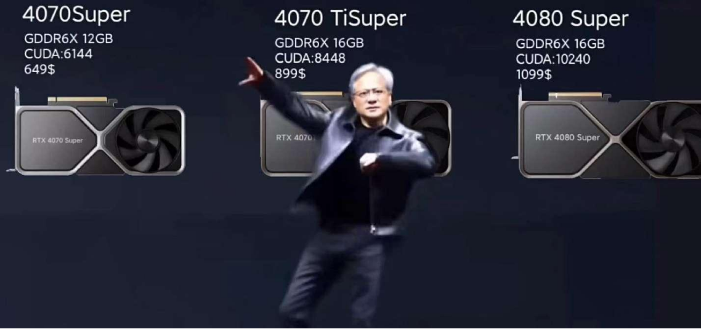

# Project 4

本次项目的重点在于开发了一个功能强大的GPU矩阵类，该类实现了多数据输入、运算符重载、感兴趣区域（ROI）操作、内存管理以及跨GPU运算等关键功能。在此过程中，我们深入研究了GPU内存与通信设计概念，并获得了对GPU CUDA编程的实践经验。这一项目不仅使我们对C/C++的特性有了更深入的了解，而且为我们进一步探索并发编程和GPU加速计算提供了坚实的基础。

本次项目的网页版本可以在这里访问：
https://laihb1106205841.github.io/GpuMat.github.io/

项目的github地址：
https://github.com/Laihb1106205841/GpuMat.github.io
